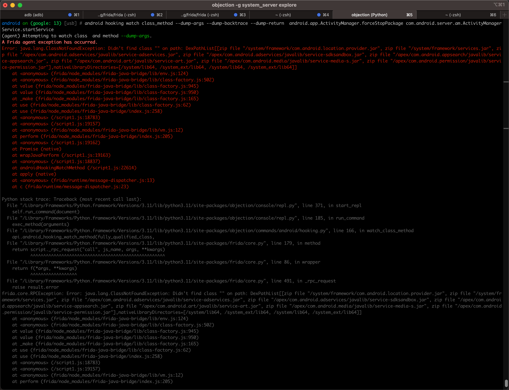

# 调试安卓常见问题

## hook安卓函数

### Attempting to watch class  and method --dump-args A Frida agent exception has occurred

* 现象

尝试去hook安卓函数：

```bash
android hooking watch class_method --dump-args --dump-backtrace --dump-return  android.app.ActivityManager.forceStopPackage com.android.server.am.ActivityManagerService.startService
```

结果报错：



```bash
android on (google: 13) [usb] # android hooking watch class_method --dump-args --dump-backtrace --dump-return  android.app.ActivityManager.forceStopPackage com.android.server.am.ActivityManager
Service.startService
(agent) Attempting to watch class  and method --dump-args.
A Frida agent exception has occurred.
Error: java.lang.ClassNotFoundException: Didn't find class "" on path: DexPathList[[zip file "/system/framework/com.android.location.provider.jar", zip file "/system/framework/services.jar", zip file "/apex/com.android.adservices/javalib/service-adservices.jar", zip file "/apex/com.android.adservices/javalib/service-sdksandbox.jar", zip file "/apex/com.android.appsearch/javalib/service-appsearch.jar", zip file "/apex/com.android.art/javalib/service-art.jar", zip file "/apex/com.android.media/javalib/service-media-s.jar", zip file "/apex/com.android.permission/javalib/service-permission.jar"],nativeLibraryDirectories=[/system/lib64, /system_ext/lib64, /system/lib64, /system_ext/lib64]]
    at <anonymous> (frida/node_modules/frida-java-bridge/lib/env.js:124)
    at <anonymous> (frida/node_modules/frida-java-bridge/lib/class-factory.js:502)
    at value (frida/node_modules/frida-java-bridge/lib/class-factory.js:945)
    at value (frida/node_modules/frida-java-bridge/lib/class-factory.js:950)
    at _make (frida/node_modules/frida-java-bridge/lib/class-factory.js:165)
    at use (frida/node_modules/frida-java-bridge/lib/class-factory.js:62)
    at use (frida/node_modules/frida-java-bridge/index.js:258)
    at <anonymous> (/script1.js:18783)
    at <anonymous> (/script1.js:19157)
    at <anonymous> (frida/node_modules/frida-java-bridge/lib/vm.js:12)
    at perform (frida/node_modules/frida-java-bridge/index.js:205)
    at <anonymous> (/script1.js:19162)
    at Promise (native)
    at wrapJavaPerform (/script1.js:19163)
    at <anonymous> (/script1.js:18837)
    at androidHookingWatchMethod (/script1.js:22614)
    at apply (native)
    at <anonymous> (frida/runtime/message-dispatcher.js:13)
    at c (frida/runtime/message-dispatcher.js:23)
```

* 原因：
  * 有2处
    * 不能同时hook 2个类的函数
    * 函数的hook参数的位置方面的语法错误
      * 细节：
        * 报错信息
          * `Attempting to watch class  and method --dump-args.`
          * `Error: java.lang.ClassNotFoundException: Didn't find class "" on path ...`
        * 中的
          * `class  and` 的`class`和`and`中间其实有个空格` `的，其实就是表示：类名是空
          * `Didn't find class ""`中的`""`，也是指的是，类名是空字符串`""`
        * 对于类名是空字符串，当然报错找不到了
* 解决办法：
  * 单次只hook 1个函数
  * 改为正确的语法 -> 要把hook函数的`--dump-args`等参数，放在类的函数的最后才行
    * 详见：[hook函数的参数](../../common_logic/hook_func_paras.md)
* 具体步骤：改为
  ```bash
  android hooking watch class_method android.app.ActivityManager.forceStopPackage --dump-args --dump-backtrace --dump-return

  android hooking watch class_method com.android.server.am.ActivityManager --dump-args --dump-backtrace --dump-return
  ```
