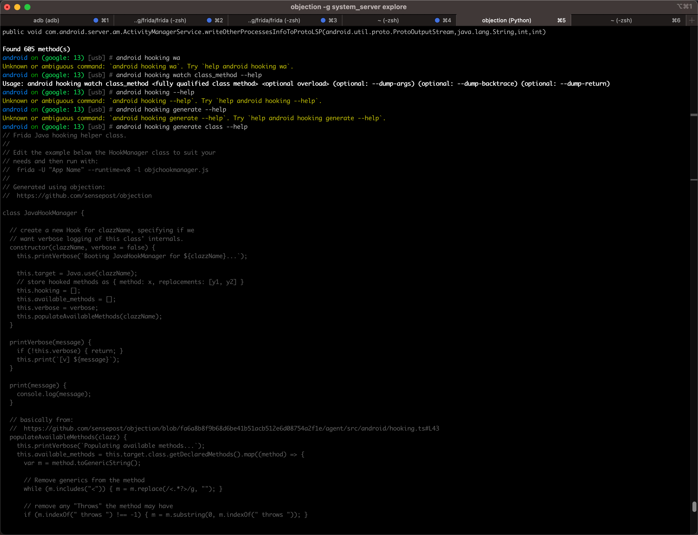

# Objection中查看子命令的参数

* 需求：Objection中，想要查看某个命令的子命令和参数
* 举例：子命令：
  ```bash
  android hooking watch class_method
  ```
  * 事后，已知，有参数：
    * `--dump-return`
    * `--dump-args`
    * `--dump-backtrace`
  * 想要知道：
    * `android hooking watch class_method`这个子命令
      * 是否还有其他什么参数
      * 以及这些参数的具体含义
* 目前已知：
  * `android hooking watch class_method`这个子命令 ，是否还有其他什么参数
    * 可以通过tab补全，会自动列出，所有可能的参数
  * 其他子命令
    * 只有最末尾，加上`--help`，可以输出基本的，精简的`help`信息
* 效果举例
  * 无法识别的
    * 图
      * 
    * 不到末尾，输入`--help`，无法识别
      * 文字
        ```bash
        android on (google: 13) [usb] # android hooking --help
        Unknown or ambiguous command: `android hooking --help`. Try `help android hooking --help`.
        android on (google: 13) [usb] # android hooking generate --help
        Unknown or ambiguous command: `android hooking generate --help`. Try `help android hooking generate --help`.
        ```
  * 正确用法
    * 只有最末尾，加上--help，可以输出基本的，精简的help信息
      ```bash
      android on (google: 13) [usb] # android hooking watch class_method --help
      Usage: android hooking watch class_method <fully qualified class method> <optional overload> (optional: --dump-args) (optional: --dump-backtrace) (optional: --dump-return)
      ```
    * 可以通过tab补全，会自动列出，所有可能的参数
      * 图
          * 
      ```bash
      android on (google: 13) [usb] # android hooking watch class_method --help
                                                                          --dump-args
                                                                          --dump-backtrace
                                                                          --dump-return
      ```
  