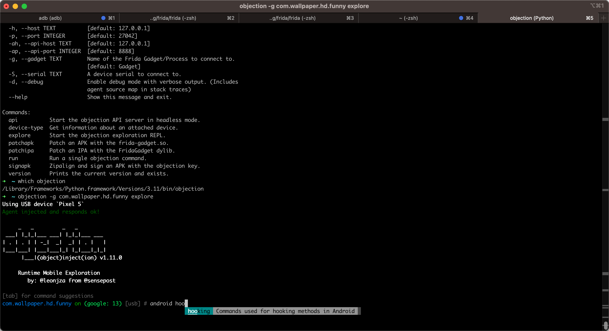
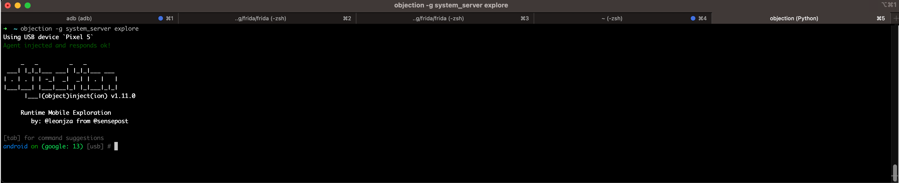

# Objection调试Android

* 用Objection去调试安卓app
  * 命令
    ```bash
    objection -g {androidAppPackageName} explore
    ```
    * 举例
      ```bash
      objection -g com.wallpaper.hd.funny explore

      objection -g system_server explore
      ```

## 举例

### Objection去调试360Wallpaper

* 背景
  * 被调试安卓app
    * app名称：`360Wallpaper`
    * 包名：`com.wallpaper.hd.funny`
* 命令
  ```bash
  objection -g com.wallpaper.hd.funny explore
  ```
  * 输出效果
    * 图
      * 
    * 文字
      ```bash
      ➜  ~ objection -g com.wallpaper.hd.funny explore
      Using USB device `Pixel 5`
      Agent injected and responds ok!

      ___| |_|_|___ ___| |_|_|___ ___
      | . | . | | -_|  _|  _| | . |   |
      |___|___| |___|___|_| |_|___|_|_|
            |___|(object)inject(ion) v1.11.0

          Runtime Mobile Exploration
              by: @leonjza from @sensepost

      [tab] for command suggestions
      com.wallpaper.hd.funny on (google: 13) [usb] #
      ```

### Objection去调试system_server

* 命令
  ```bash
  objection -g system_server explore
  ```
  * 输出效果
    * 图
      * 
    * 文字
      ```bash
      ➜  ~ objection -g system_server explore
      Using USB device `Pixel 5`
      Agent injected and responds ok!

      ___| |_|_|___ ___| |_|_|___ ___
      | . | . | | -_|  _|  _| | . |   |
      |___|___| |___|___|_| |_|___|_|_|
            |___|(object)inject(ion) v1.11.0
          Runtime Mobile Exploration
              by: @leonjza from @sensepost

      [tab] for command suggestions
      android on (google: 13) [usb] #
      ```
