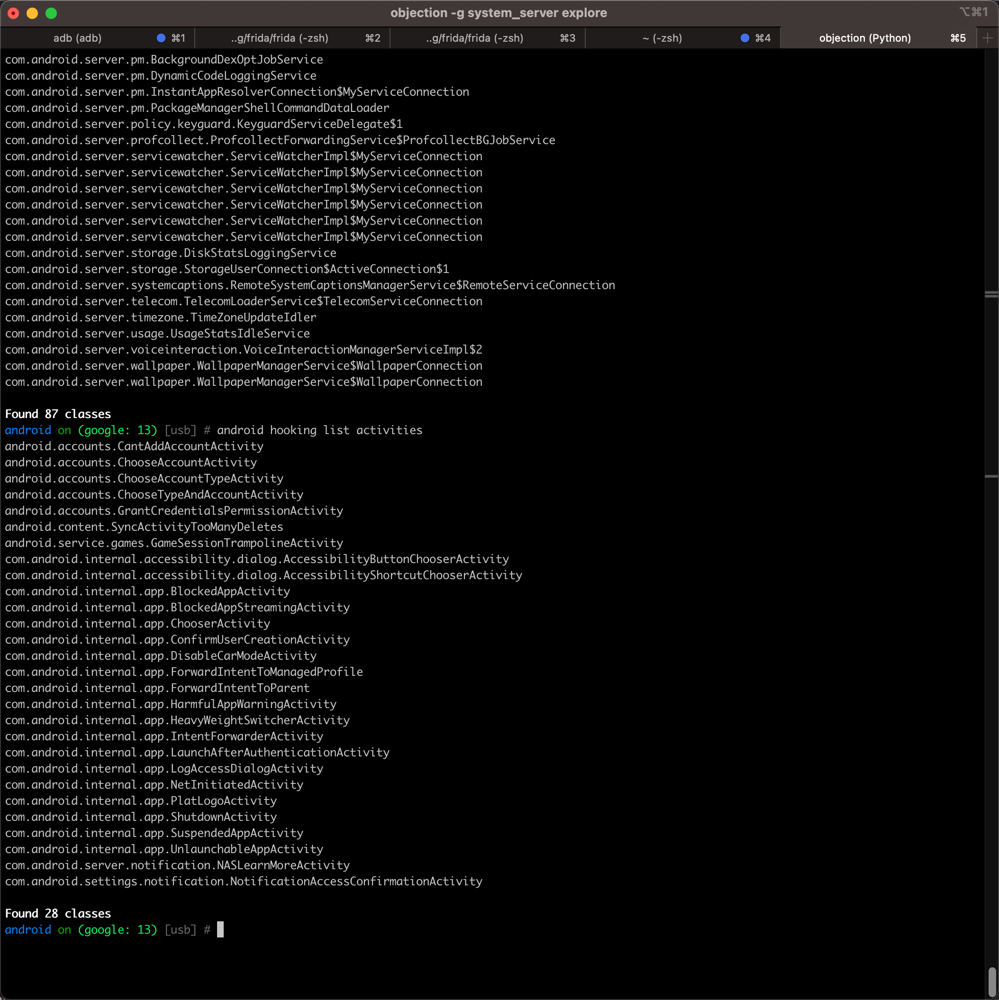
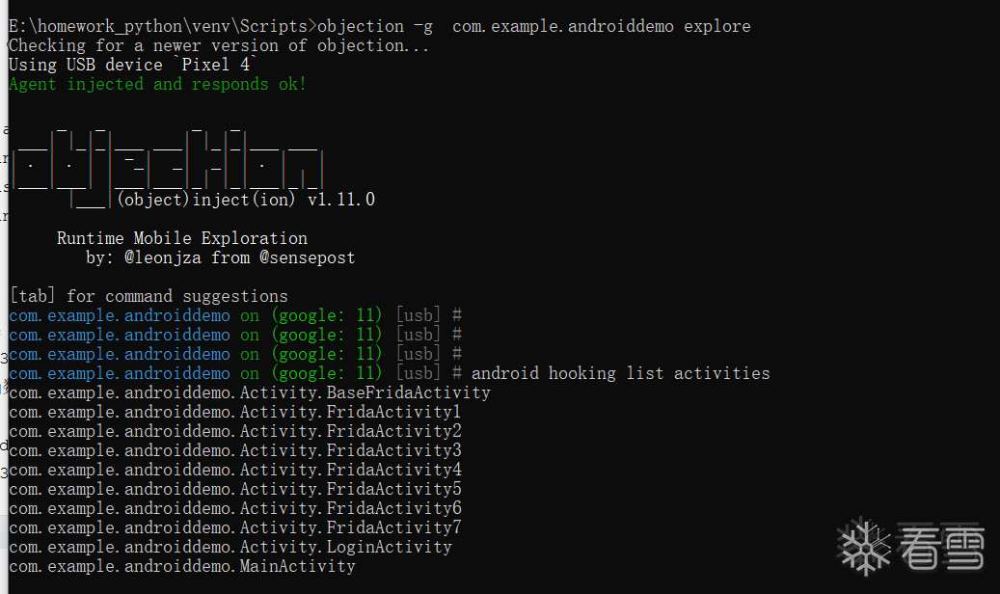

# android hooking list activities

Objection去hook列出Activity页面：

* 命令
  ```bash
  android hooking list activities
  ```

## 举例

### system_server



```bash
android on (google: 13) [usb] # android hooking list activities
android.accounts.CantAddAccountActivity
android.accounts.ChooseAccountActivity
android.accounts.ChooseAccountTypeActivity
android.accounts.ChooseTypeAndAccountActivity
android.accounts.GrantCredentialsPermissionActivity
android.content.SyncActivityTooManyDeletes
android.service.games.GameSessionTrampolineActivity
com.android.internal.accessibility.dialog.AccessibilityButtonChooserActivity
com.android.internal.accessibility.dialog.AccessibilityShortcutChooserActivity
com.android.internal.app.BlockedAppActivity
com.android.internal.app.BlockedAppStreamingActivity
com.android.internal.app.ChooserActivity
com.android.internal.app.ConfirmUserCreationActivity
com.android.internal.app.DisableCarModeActivity
com.android.internal.app.ForwardIntentToManagedProfile
com.android.internal.app.ForwardIntentToParent
com.android.internal.app.HarmfulAppWarningActivity
com.android.internal.app.HeavyWeightSwitcherActivity
com.android.internal.app.IntentForwarderActivity
com.android.internal.app.LaunchAfterAuthenticationActivity
com.android.internal.app.LogAccessDialogActivity
com.android.internal.app.NetInitiatedActivity
com.android.internal.app.PlatLogoActivity
com.android.internal.app.ShutdownActivity
com.android.internal.app.SuspendedAppActivity
com.android.internal.app.UnlaunchableAppActivity
com.android.server.notification.NASLearnMoreActivity
com.android.settings.notification.NotificationAccessConfirmationActivity

Found 28 classes
```

### com.example.androiddemo


