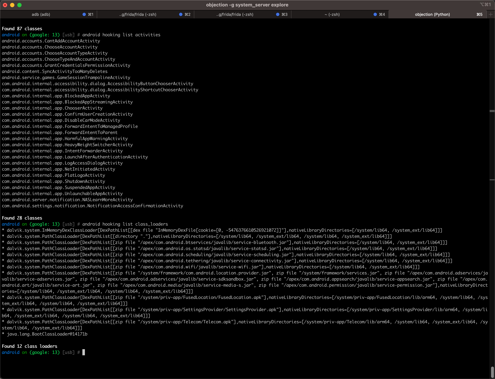

# android hooking list class_loaders

Objection去hook列出类加载器：

* 命令
  ```bash
  android hooking list class_loaders
  ```

## 举例

### system_server

* 命令
  ```bash
  android hooking list class_loaders
  ```
  * 图
    * 
  * log
    ```bash
    android on (google: 13) [usb] # android hooking list class_loaders
    * dalvik.system.InMemoryDexClassLoader[DexPathList[[dex file "InMemoryDexFile[cookie=[0, -5476376610526921072]]"],nativeLibraryDirectories=[/system/lib64, /system_ext/lib64]]]
    * dalvik.system.PathClassLoader[DexPathList[[directory "."],nativeLibraryDirectories=[/system/lib64, /system_ext/lib64, /system/lib64, /system_ext/lib64]]]
    * dalvik.system.PathClassLoader[DexPathList[[zip file "/apex/com.android.btservices/javalib/service-bluetooth.jar"],nativeLibraryDirectories=[/system/lib64, /system_ext/lib64]]]
    * dalvik.system.PathClassLoader[DexPathList[[zip file "/apex/com.android.os.statsd/javalib/service-statsd.jar"],nativeLibraryDirectories=[/system/lib64, /system_ext/lib64]]]
    * dalvik.system.PathClassLoader[DexPathList[[zip file "/apex/com.android.scheduling/javalib/service-scheduling.jar"],nativeLibraryDirectories=[/system/lib64, /system_ext/lib64]]]
    * dalvik.system.PathClassLoader[DexPathList[[zip file "/apex/com.android.tethering/javalib/service-connectivity.jar"],nativeLibraryDirectories=[/system/lib64, /system_ext/lib64]]]
    * dalvik.system.PathClassLoader[DexPathList[[zip file "/apex/com.android.wifi/javalib/service-wifi.jar"],nativeLibraryDirectories=[/system/lib64, /system_ext/lib64]]]
    * dalvik.system.PathClassLoader[DexPathList[[zip file "/system/framework/com.android.location.provider.jar", zip file "/system/framework/services.jar", zip file "/apex/com.android.adservices/javalib/service-adservices.jar", zip file "/apex/com.android.adservices/javalib/service-sdksandbox.jar", zip file "/apex/com.android.appsearch/javalib/service-appsearch.jar", zip file "/apex/com.android.art/javalib/service-art.jar", zip file "/apex/com.android.media/javalib/service-media-s.jar", zip file "/apex/com.android.permission/javalib/service-permission.jar"],nativeLibraryDirectories=[/system/lib64, /system_ext/lib64, /system/lib64, /system_ext/lib64]]]
    * dalvik.system.PathClassLoader[DexPathList[[zip file "/system/priv-app/FusedLocation/FusedLocation.apk"],nativeLibraryDirectories=[/system/priv-app/FusedLocation/lib/arm64, /system/lib64, /system_ext/lib64, /system/lib64, /system_ext/lib64]]]
    * dalvik.system.PathClassLoader[DexPathList[[zip file "/system/priv-app/SettingsProvider/SettingsProvider.apk"],nativeLibraryDirectories=[/system/priv-app/SettingsProvider/lib/arm64, /system/lib64, /system_ext/lib64, /system/lib64, /system_ext/lib64]]]
    * dalvik.system.PathClassLoader[DexPathList[[zip file "/system/priv-app/Telecom/Telecom.apk"],nativeLibraryDirectories=[/system/priv-app/Telecom/lib/arm64, /system/lib64, /system_ext/lib64, /system/lib64, /system_ext/lib64]]]
    * java.lang.BootClassLoader@14171b

    Found 12 class loaders
    ```
