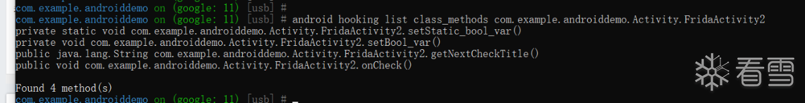
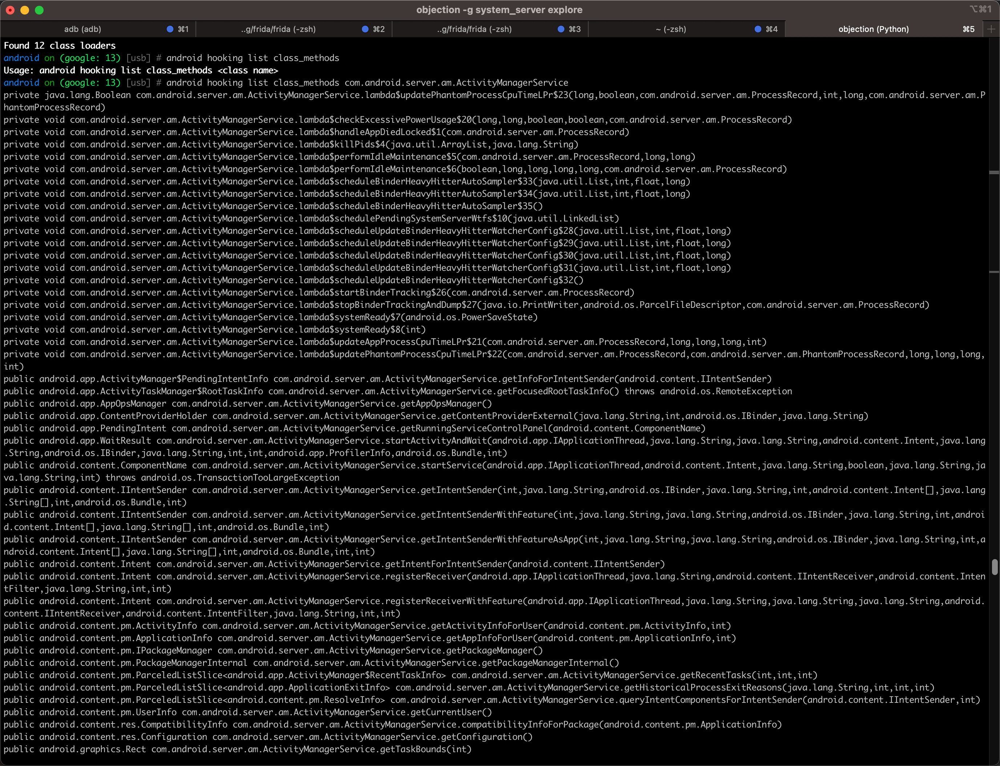
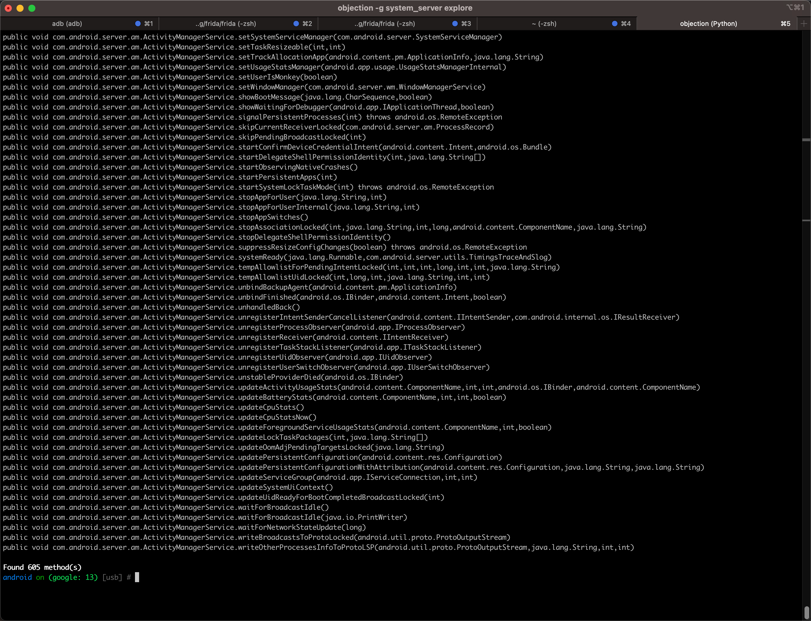

# android hooking list class_methods

Objection去hook列出单个类的所有函数`class_methods`：

* 语法
  ```bash
  android hooking list class_methods {AndroidClassName}
  ```
  * 注
    * 如果不带参数，则会提示语法
      ```bash
      android on (google: 13) [usb] # android hooking list class_methods
      Usage: android hooking list class_methods <class name>
      ```

## 举例

### com.example.androiddemo.Activity.FridaActivity2

* 命令
  ```bash
  android hooking list class_methods com.example.androiddemo.Activity.FridaActivity2
  ```
    * 

### system_server

* 命令
  ```bash
  android hooking list class_methods com.android.server.am.ActivityManagerService
  ```
    * 图
      * 
      * 
    * log
      ```bash
      android on (google: 13) [usb] # android hooking list class_methods com.android.server.am.ActivityManagerService
      private java.lang.Boolean com.android.server.am.ActivityManagerService.lambda$updatePhantomProcessCpuTimeLPr$23(long,boolean,com.android.server.am.ProcessRecord,int,long,com.android.server.am.PhantomProcessRecord)
      private void com.android.server.am.ActivityManagerService.lambda$checkExcessivePowerUsage$20(long,long,boolean,boolean,com.android.server.am.ProcessRecord)
      private void com.android.server.am.ActivityManagerService.lambda$handleAppDiedLocked$1(com.android.server.am.ProcessRecord)
      private void com.android.server.am.ActivityManagerService.lambda$killPids$4(java.util.ArrayList,java.lang.String)
      private void com.android.server.am.ActivityManagerService.lambda$performIdleMaintenance$5(com.android.server.am.ProcessRecord,long,long)
      private void com.android.server.am.ActivityManagerService.lambda$performIdleMaintenance$6(boolean,long,long,long,long,com.android.server.am.ProcessRecord)
      private void com.android.server.am.ActivityManagerService.lambda$scheduleBinderHeavyHitterAutoSampler$33(java.util.List,int,float,long)
      private void com.android.server.am.ActivityManagerService.lambda$scheduleBinderHeavyHitterAutoSampler$34(java.util.List,int,float,long)
      private void com.android.server.am.ActivityManagerService.lambda$scheduleBinderHeavyHitterAutoSampler$35()
      private void com.android.server.am.ActivityManagerService.lambda$schedulePendingSystemServerWtfs$10(java.util.LinkedList)
      private void com.android.server.am.ActivityManagerService.lambda$scheduleUpdateBinderHeavyHitterWatcherConfig$28(java.util.List,int,float,long)
      private void com.android.server.am.ActivityManagerService.lambda$scheduleUpdateBinderHeavyHitterWatcherConfig$29(java.util.List,int,float,long)
      private void com.android.server.am.ActivityManagerService.lambda$scheduleUpdateBinderHeavyHitterWatcherConfig$30(java.util.List,int,float,long)
      private void com.android.server.am.ActivityManagerService.lambda$scheduleUpdateBinderHeavyHitterWatcherConfig$31(java.util.List,int,float,long)
      private void com.android.server.am.ActivityManagerService.lambda$scheduleUpdateBinderHeavyHitterWatcherConfig$32()
      private void com.android.server.am.ActivityManagerService.lambda$startBinderTracking$26(com.android.server.am.ProcessRecord)
      private void com.android.server.am.ActivityManagerService.lambda$stopBinderTrackingAndDump$27(java.io.PrintWriter,android.os.ParcelFileDescriptor,com.android.server.am.ProcessRecord)
      private void com.android.server.am.ActivityManagerService.lambda$systemReady$7(android.os.PowerSaveState)
      private void com.android.server.am.ActivityManagerService.lambda$systemReady$8(int)
      ...
      public void com.android.server.am.ActivityManagerService.startPersistentApps(int)
      public void com.android.server.am.ActivityManagerService.startSystemLockTaskMode(int) throws android.os.RemoteException
      public void com.android.server.am.ActivityManagerService.stopAppForUser(java.lang.String,int)
      public void com.android.server.am.ActivityManagerService.stopAppForUserInternal(java.lang.String,int)
      public void com.android.server.am.ActivityManagerService.stopAppSwitches()
      public void com.android.server.am.ActivityManagerService.stopAssociationLocked(int,java.lang.String,int,long,android.content.ComponentName,java.lang.String)
      public void com.android.server.am.ActivityManagerService.stopDelegateShellPermissionIdentity()
      public void com.android.server.am.ActivityManagerService.suppressResizeConfigChanges(boolean) throws android.os.RemoteException
      public void com.android.server.am.ActivityManagerService.systemReady(java.lang.Runnable,com.android.server.utils.TimingsTraceAndSlog)
      public void com.android.server.am.ActivityManagerService.tempAllowlistForPendingIntentLocked(int,int,int,long,int,int,java.lang.String)
      public void com.android.server.am.ActivityManagerService.tempAllowlistUidLocked(int,long,int,java.lang.String,int,int)
      public void com.android.server.am.ActivityManagerService.unbindBackupAgent(android.content.pm.ApplicationInfo)
      public void com.android.server.am.ActivityManagerService.unbindFinished(android.os.IBinder,android.content.Intent,boolean)
      public void com.android.server.am.ActivityManagerService.unhandledBack()
      public void com.android.server.am.ActivityManagerService.unregisterIntentSenderCancelListener(android.content.IIntentSender,com.android.internal.os.IResultReceiver)
      public void com.android.server.am.ActivityManagerService.unregisterProcessObserver(android.app.IProcessObserver)
      public void com.android.server.am.ActivityManagerService.unregisterReceiver(android.content.IIntentReceiver)
      public void com.android.server.am.ActivityManagerService.unregisterTaskStackListener(android.app.ITaskStackListener)
      public void com.android.server.am.ActivityManagerService.unregisterUidObserver(android.app.IUidObserver)
      public void com.android.server.am.ActivityManagerService.unregisterUserSwitchObserver(android.app.IUserSwitchObserver)
      public void com.android.server.am.ActivityManagerService.unstableProviderDied(android.os.IBinder)
      public void com.android.server.am.ActivityManagerService.updateActivityUsageStats(android.content.ComponentName,int,int,android.os.IBinder,android.content.ComponentName)
      public void com.android.server.am.ActivityManagerService.updateBatteryStats(android.content.ComponentName,int,int,boolean)
      public void com.android.server.am.ActivityManagerService.updateCpuStats()
      public void com.android.server.am.ActivityManagerService.updateCpuStatsNow()
      public void com.android.server.am.ActivityManagerService.updateForegroundServiceUsageStats(android.content.ComponentName,int,boolean)
      public void com.android.server.am.ActivityManagerService.updateLockTaskPackages(int,java.lang.String[])
      public void com.android.server.am.ActivityManagerService.updateOomAdjPendingTargetsLocked(java.lang.String)
      public void com.android.server.am.ActivityManagerService.updatePersistentConfiguration(android.content.res.Configuration)
      public void com.android.server.am.ActivityManagerService.updatePersistentConfigurationWithAttribution(android.content.res.Configuration,java.lang.String,java.lang.String)
      public void com.android.server.am.ActivityManagerService.updateServiceGroup(android.app.IServiceConnection,int,int)
      public void com.android.server.am.ActivityManagerService.updateSystemUiContext()
      public void com.android.server.am.ActivityManagerService.updateUidReadyForBootCompletedBroadcastLocked(int)
      public void com.android.server.am.ActivityManagerService.waitForBroadcastIdle()
      public void com.android.server.am.ActivityManagerService.waitForBroadcastIdle(java.io.PrintWriter)
      public void com.android.server.am.ActivityManagerService.waitForNetworkStateUpdate(long)
      public void com.android.server.am.ActivityManagerService.writeBroadcastsToProtoLocked(android.util.proto.ProtoOutputStream)
      public void com.android.server.am.ActivityManagerService.writeOtherProcessesInfoToProtoLSP(android.util.proto.ProtoOutputStream,java.lang.String,int,int)

      Found 605 method(s)
      android on (google: 13) [usb] #
      ```
