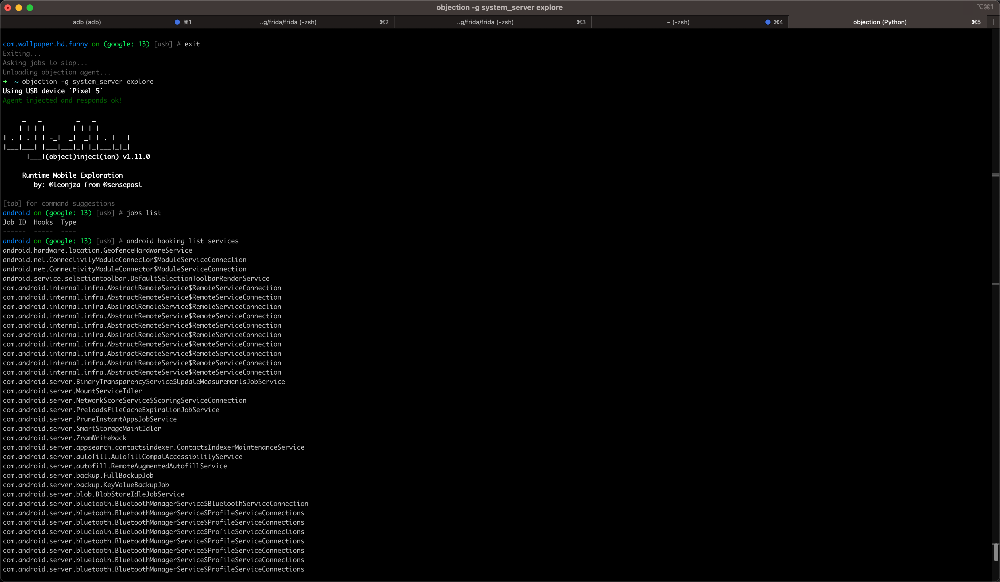
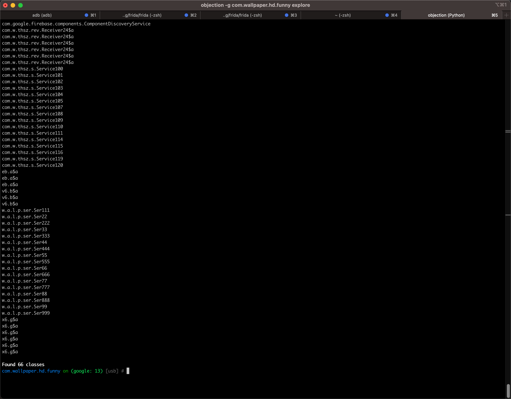

# android hooking list services

Objection去hook列出服务进程：

* 命令
  ```bash
  android hooking list services
  ```

## 举例

### system_server

* 截图
  * 
* 文字
  ```bash
  android on (google: 13) [usb] # android hooking list services
  android.hardware.location.GeofenceHardwareService
  android.net.ConnectivityModuleConnector$ModuleServiceConnection
  android.net.ConnectivityModuleConnector$ModuleServiceConnection
  android.service.selectiontoolbar.DefaultSelectionToolbarRenderService
  com.android.internal.infra.AbstractRemoteService$RemoteServiceConnection
  com.android.internal.infra.AbstractRemoteService$RemoteServiceConnection
  com.android.internal.infra.AbstractRemoteService$RemoteServiceConnection
  com.android.internal.infra.AbstractRemoteService$RemoteServiceConnection
  com.android.internal.infra.AbstractRemoteService$RemoteServiceConnection
  com.android.internal.infra.AbstractRemoteService$RemoteServiceConnection
  com.android.internal.infra.AbstractRemoteService$RemoteServiceConnection
  com.android.internal.infra.AbstractRemoteService$RemoteServiceConnection
  com.android.internal.infra.AbstractRemoteService$RemoteServiceConnection
  com.android.internal.infra.AbstractRemoteService$RemoteServiceConnection
  com.android.server.BinaryTransparencyService$UpdateMeasurementsJobService
  com.android.server.MountServiceIdler
  com.android.server.NetworkScoreService$ScoringServiceConnection
  com.android.server.PreloadsFileCacheExpirationJobService
  com.android.server.PruneInstantAppsJobService
  com.android.server.SmartStorageMaintIdler
  com.android.server.ZramWriteback
  com.android.server.appsearch.contactsindexer.ContactsIndexerMaintenanceService
  com.android.server.autofill.AutofillCompatAccessibilityService
  com.android.server.autofill.RemoteAugmentedAutofillService
  com.android.server.backup.FullBackupJob
  com.android.server.backup.KeyValueBackupJob
  com.android.server.blob.BlobStoreIdleJobService
  com.android.server.bluetooth.BluetoothManagerService$BluetoothServiceConnection
  com.android.server.bluetooth.BluetoothManagerService$ProfileServiceConnections
  com.android.server.bluetooth.BluetoothManagerService$ProfileServiceConnections
  com.android.server.bluetooth.BluetoothManagerService$ProfileServiceConnections
  com.android.server.bluetooth.BluetoothManagerService$ProfileServiceConnections
  com.android.server.bluetooth.BluetoothManagerService$ProfileServiceConnections
  com.android.server.bluetooth.BluetoothManagerService$ProfileServiceConnections
  com.android.server.bluetooth.BluetoothManagerService$ProfileServiceConnections
  com.android.server.bluetooth.BluetoothManagerService$ProfileServiceConnections
  com.android.server.bluetooth.BluetoothManagerService$ProfileServiceConnections
  com.android.server.camera.CameraStatsJobService
  com.android.server.companion.InactiveAssociationsRemovalService
  com.android.server.compos.IsolatedCompilationJobService
  com.android.server.content.SyncJobService
  com.android.server.content.SyncManager$ActiveSyncContext
  com.android.server.content.SyncManager$ActiveSyncContext
  com.android.server.content.SyncManager$ActiveSyncContext
  com.android.server.content.SyncManager$ActiveSyncContext
  com.android.server.display.BrightnessIdleJob
  com.android.server.dreams.DreamController$DreamRecord
  com.android.server.inputmethod.InputMethodBindingController$2
  com.android.server.job.JobServiceContext
  com.android.server.job.JobServiceContext
  com.android.server.job.JobServiceContext
  com.android.server.job.JobServiceContext
  com.android.server.job.JobServiceContext
  com.android.server.location.geofence.GeofenceProxy$GeofenceProxyServiceConnection
  com.android.server.net.watchlist.ReportWatchlistJobService
  com.android.server.notification.ManagedServices$1
  com.android.server.notification.ManagedServices$1
  com.android.server.notification.ManagedServices$1
  com.android.server.notification.ManagedServices$1
  com.android.server.notification.ManagedServices$1
  com.android.server.notification.ManagedServices$1
  com.android.server.notification.ManagedServices$1
  com.android.server.notification.ManagedServices$1
  com.android.server.notification.NotificationHistoryJobService
  com.android.server.notification.ReviewNotificationPermissionsJobService
  com.android.server.people.data.DataMaintenanceService
  com.android.server.pm.BackgroundDexOptJobService
  com.android.server.pm.DynamicCodeLoggingService
  com.android.server.pm.InstantAppResolverConnection$MyServiceConnection
  com.android.server.pm.PackageManagerShellCommandDataLoader
  com.android.server.policy.keyguard.KeyguardServiceDelegate$1
  com.android.server.profcollect.ProfcollectForwardingService$ProfcollectBGJobService
  com.android.server.servicewatcher.ServiceWatcherImpl$MyServiceConnection
  com.android.server.servicewatcher.ServiceWatcherImpl$MyServiceConnection
  com.android.server.servicewatcher.ServiceWatcherImpl$MyServiceConnection
  com.android.server.servicewatcher.ServiceWatcherImpl$MyServiceConnection
  com.android.server.servicewatcher.ServiceWatcherImpl$MyServiceConnection
  com.android.server.servicewatcher.ServiceWatcherImpl$MyServiceConnection
  com.android.server.storage.DiskStatsLoggingService
  com.android.server.storage.StorageUserConnection$ActiveConnection$1
  com.android.server.systemcaptions.RemoteSystemCaptionsManagerService$RemoteServiceConnection
  com.android.server.telecom.TelecomLoaderService$TelecomServiceConnection
  com.android.server.timezone.TimeZoneUpdateIdler
  com.android.server.usage.UsageStatsIdleService
  com.android.server.voiceinteraction.VoiceInteractionManagerServiceImpl$2
  com.android.server.wallpaper.WallpaperManagerService$WallpaperConnection
  com.android.server.wallpaper.WallpaperManagerService$WallpaperConnection

  Found 87 classes
  android on (google: 13) [usb] #
  ```

### com.wallpaper.hd.funny

* 截图
  * 
  * 
* 文字
  ```bash
  com.wallpaper.hd.funny on (google: 13) [usb] # android hooking list services
  androidx.room.MultiInstanceInvalidationService
  bk
  bk
  com.applovin.impl.adview.activity.FullscreenAdService
  com.applovin.impl.sdk.utils.AppKilledService
  com.blankj.utilcode.util.MessengerUtils$ServerService
  com.bytedance.sdk.openadsdk.multipro.aidl.BinderPoolService
  com.bytedance.sdk.openadsdk.multipro.aidl.a$1
  com.exp.wallpaper.ser.LiveSer
  com.google.android.datatransport.runtime.backends.TransportBackendDiscovery
  com.google.android.datatransport.runtime.scheduling.jobscheduling.JobInfoSchedulerService
  com.google.android.gms.auth.api.signin.RevocationBoundService
  com.google.android.gms.measurement.AppMeasurementJobService
  com.google.android.gms.measurement.AppMeasurementService
  com.google.firebase.components.ComponentDiscoveryService
  com.w.thsz.rev.Receiver24$a
  com.w.thsz.rev.Receiver24$a
  com.w.thsz.rev.Receiver24$a
  com.w.thsz.rev.Receiver24$a
  com.w.thsz.rev.Receiver24$a
  com.w.thsz.rev.Receiver24$a
  com.w.thsz.s.Service100
  com.w.thsz.s.Service101
  com.w.thsz.s.Service102
  com.w.thsz.s.Service103
  com.w.thsz.s.Service104
  com.w.thsz.s.Service105
  com.w.thsz.s.Service107
  com.w.thsz.s.Service108
  com.w.thsz.s.Service109
  com.w.thsz.s.Service110
  com.w.thsz.s.Service111
  com.w.thsz.s.Service114
  com.w.thsz.s.Service115
  com.w.thsz.s.Service116
  com.w.thsz.s.Service119
  com.w.thsz.s.Service120
  eb.a$a
  eb.a$a
  eb.a$a
  v6.b$a
  v6.b$a
  v6.b$a
  w.a.l.p.ser.Ser111
  w.a.l.p.ser.Ser22
  w.a.l.p.ser.Ser222
  w.a.l.p.ser.Ser33
  w.a.l.p.ser.Ser333
  w.a.l.p.ser.Ser44
  w.a.l.p.ser.Ser444
  w.a.l.p.ser.Ser55
  w.a.l.p.ser.Ser555
  w.a.l.p.ser.Ser66
  w.a.l.p.ser.Ser666
  w.a.l.p.ser.Ser77
  w.a.l.p.ser.Ser777
  w.a.l.p.ser.Ser88
  w.a.l.p.ser.Ser888
  w.a.l.p.ser.Ser99
  w.a.l.p.ser.Ser999
  x6.g$a
  x6.g$a
  x6.g$a
  x6.g$a
  x6.g$a
  x6.g$a

  Found 66 classes
  com.wallpaper.hd.funny on (google: 13) [usb] #
  ```
