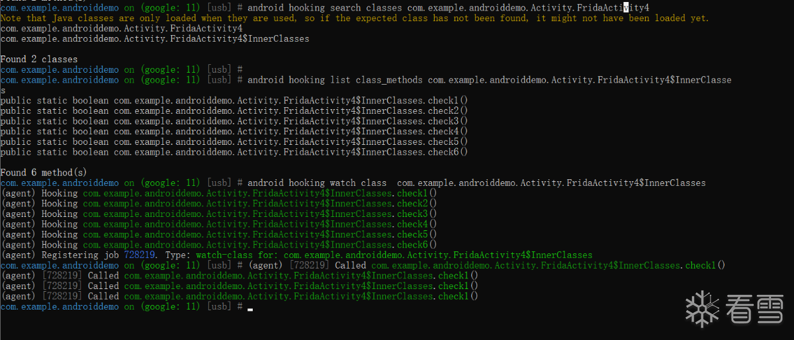

# android hooking search

## android hooking search classes

* 命令
  ```bash
  android hooking search classes {AndroidClassName}
  ```
  * 举例
    ```bash
    android hooking search classes com.example.androiddemo.Activity.FridaActivity4
    ```
      * 
