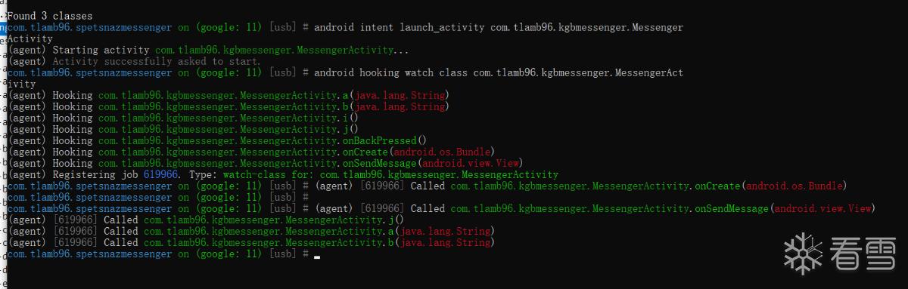
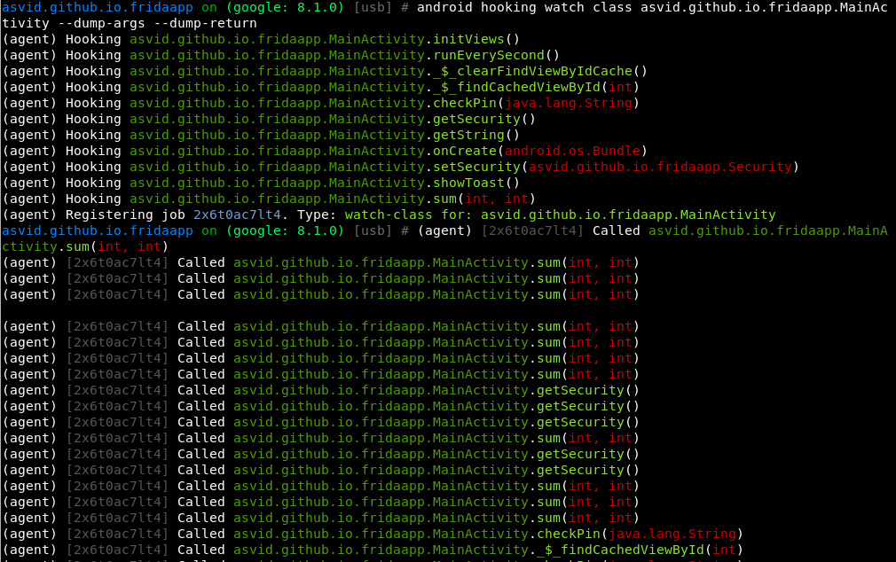
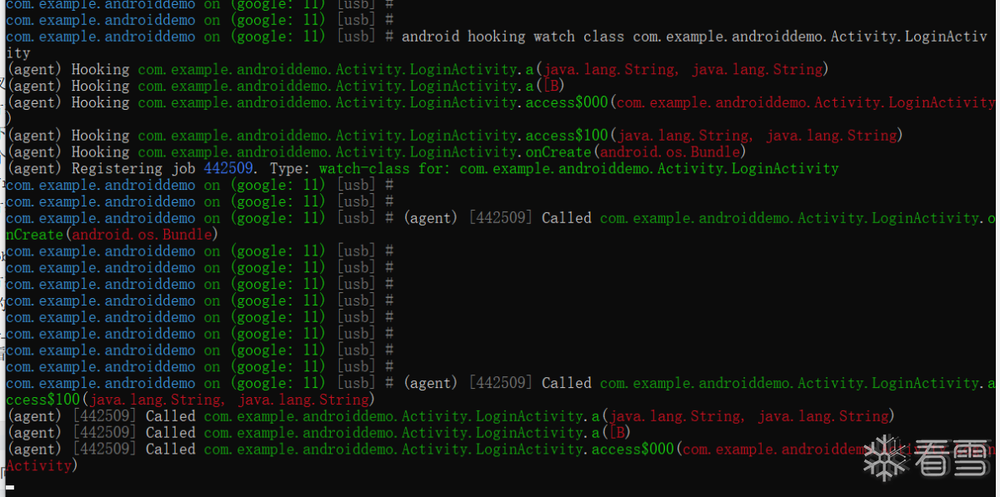
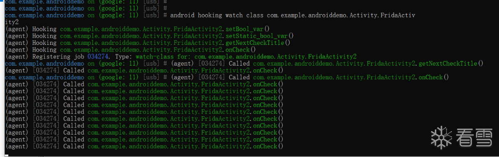
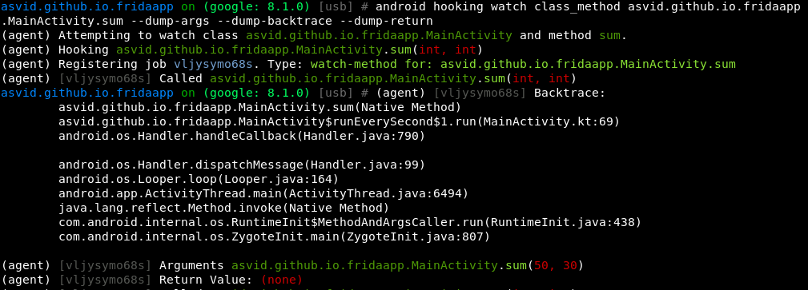
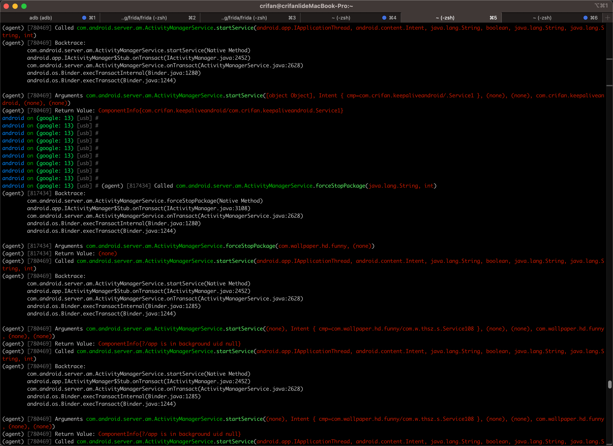
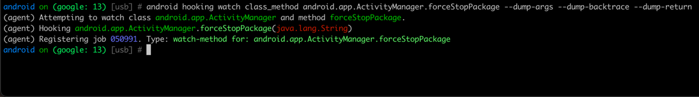
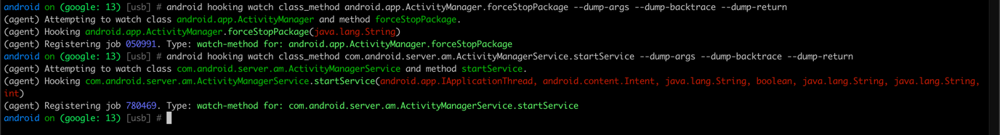
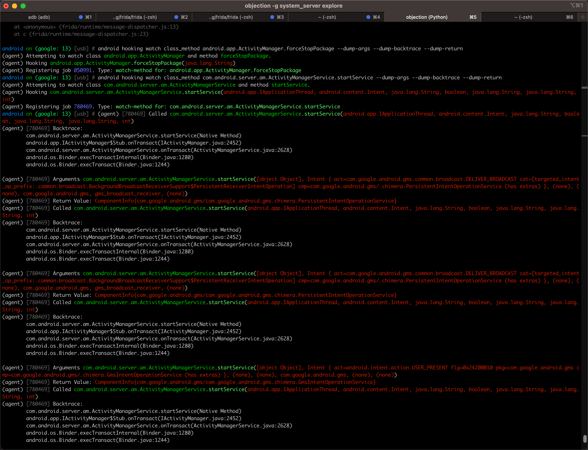
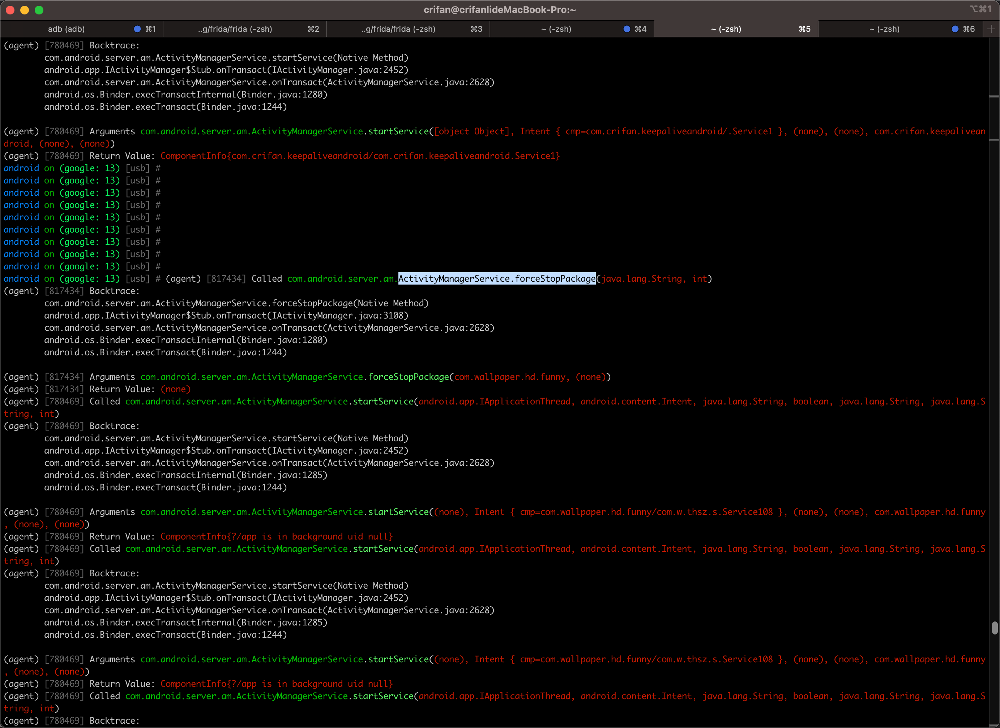

# android hooking watch

## hook安卓的类

* 命令
  ```bash
  android hooking watch class {androidFullClassName}
  ```

### 举例

#### com.tlamb96.kgbmessenger.MessengerActivity

* 命令
  ```bash
  android hooking watch class com.tlamb96.kgbmessenger.MessengerActivity
  ```
    * 

#### asvid.github.io.fridaapp.MainActivity

* 命令
  ```bash
  android hooking watch class asvid.github.io.fridaapp.MainActivity --dump-args --dump-return
  ```
    * 

#### com.example.androiddemo.Activity.LoginActivity

* 命令
  ```bash
  android hooking watch class com.example.androiddemo.Activity.LoginActivity
  ```
    * 

#### com.example.androiddemo.Activity.FridaActivity2

* 命令
  ```bash
  android hooking watch class com.example.androiddemo.Activity.FridaActivity2
  ```
    * 

## hook安卓的函数

* 命令
  ```bash
  android hooking watch class_method {androidFunctionName}
  ```

### 举例

#### asvid.github.io.fridaapp.MainActivity.sum

* 命令
  ```bash
  android hooking watch class_method asvid.github.io.fridaapp.MainActivity.sum --dump-args --dump-backtrace --dump-return
  ```
  * 

#### com.android.server.am.ActivityManagerService.forceStopPackage

* 命令
  ```bash
  android hooking watch class_method com.android.server.am.ActivityManagerService.forceStopPackage --dump-args --dump-backtrace --dump-return
  ```
  * 图
    * 
  * log
    * 添加时
      ```bash
      android on (google: 13) [usb] # android hooking watch class_method com.android.server.am.ActivityManagerService.forceStopPackage --dump-args --dump-backtrace --dump-return
      (agent) Attempting to watch class com.android.server.am.ActivityManagerService and method forceStopPackage.
      (agent) Hooking com.android.server.am.ActivityManagerService.forceStopPackage(java.lang.String, int)
      (agent) Registering job 817434. Type: watch-method for: com.android.server.am.ActivityManagerService.forceStopPackage
      ```
    * 触发时
      ```bash
      android on (google: 13) [usb] # (agent) [817434] Called com.android.server.am.ActivityManagerService.forceStopPackage(java.lang.String, int)
      (agent) [817434] Backtrace:
          com.android.server.am.ActivityManagerService.forceStopPackage(Native Method)
              android.app.IActivityManager$Stub.onTransact(IActivityManager.java:3108)
          com.android.server.am.ActivityManagerService.onTransact(ActivityManagerService.java:2628)
          android.os.Binder.execTransactInternal(Binder.java:1280)
          android.os.Binder.execTransact(Binder.java:1244)

      (agent) [817434] Arguments com.android.server.am.ActivityManagerService.forceStopPackage(com.wallpaper.hd.funny, (none))
      (agent) [817434] Return Value: (none)
      ```

#### android.app.ActivityManager.forceStopPackage

* 命令
  ```bash
  android hooking watch class_method android.app.ActivityManager.forceStopPackage --dump-args --dump-backtrace --dump-return
  ```
  * 图
    * 
  * log
    ```bash
    android on (google: 13) [usb] # android hooking watch class_method android.app.ActivityManager.forceStopPackage --dump-args --dump-backtrace --dump-return
    (agent) Attempting to watch class android.app.ActivityManager and method forceStopPackage.
    (agent) Hooking android.app.ActivityManager.forceStopPackage(java.lang.String)
    (agent) Registering job 050991. Type: watch-method for: android.app.ActivityManager.forceStopPackage
    ```

#### com.android.server.am.ActivityManagerService.startService

* 命令
  ```bash
  android hooking watch class_method com.android.server.am.ActivityManagerService.startService --dump-args --dump-backtrace --dump-return
  ```
  * 图
    * 
  * log
    ```bash
    android on (google: 13) [usb] # android hooking watch class_method com.android.server.am.ActivityManagerService.startService --dump-args --dump-backtrace --dump-return
    (agent) Attempting to watch class com.android.server.am.ActivityManagerService and method startService.
    (agent) Hooking com.android.server.am.ActivityManagerService.startService(android.app.IApplicationThread, android.content.Intent, java.lang.String, boolean, java.lang.String, java.lang.String, int)
    (agent) Registering job 780469. Type: watch-method for: com.android.server.am.ActivityManagerService.startService
    ```
* 触发时效果
  * 效果1
    * 图
      * 
    * log
      ```bash
      android on (google: 13) [usb] # (agent) [780469] Called com.android.server.am.ActivityManagerService.startService(android.app.IApplicationThread, android.content.Intent, java.lang.String, boolean, java.lang.String, java.lang.String, int)
      (agent) [780469] Backtrace:
              com.android.server.am.ActivityManagerService.startService(Native Method)
          android.app.IActivityManager$Stub.onTransact(IActivityManager.java:2452)
          com.android.server.am.ActivityManagerService.onTransact(ActivityManagerService.java:2628)
          android.os.Binder.execTransactInternal(Binder.java:1280)
          android.os.Binder.execTransact(Binder.java:1244)

      (agent) [780469] Arguments com.android.server.am.ActivityManagerService.startService([object Object], Intent { act=com.google.android.gms.common.broadcast.DELIVER_BROADCAST cat=[targeted_intent_op_prefix:.common.broadcast.BackgroundBroadcastReceiverSupport$PersistentReceiverIntentOperation] cmp=com.google.android.gms/.chimera.PersistentIntentOperationService (has extras) }, (none), (none), com.google.android.gms, gms_broadcast_receiver, (none))
      (agent) [780469] Return Value: ComponentInfo{com.google.android.gms/com.google.android.gms.chimera.PersistentIntentOperationService}
      (agent) [780469] Called com.android.server.am.ActivityManagerService.startService(android.app.IApplicationThread, android.content.Intent, java.lang.String, boolean, java.lang.String, java.lang.String, int)
      (agent) [780469] Backtrace:
          com.android.server.am.ActivityManagerService.startService(Native Method)
          android.app.IActivityManager$Stub.onTransact(IActivityManager.java:2452)
          com.android.server.am.ActivityManagerService.onTransact(ActivityManagerService.java:2628)
          android.os.Binder.execTransactInternal(Binder.java:1280)
          android.os.Binder.execTransact(Binder.java:1244)

      (agent) [780469] Arguments com.android.server.am.ActivityManagerService.startService([object Object], Intent { act=com.google.android.gms.common.broadcast.DELIVER_BROADCAST cat=[targeted_intent_op_prefix:.common.broadcast.BackgroundBroadcastReceiverSupport$PersistentReceiverIntentOperation] cmp=com.google.android.gms/.chimera.PersistentIntentOperationService (has extras) }, (none), (none), com.google.android.gms, gms_broadcast_receiver, (none))
      (agent) [780469] Return Value: ComponentInfo{com.google.android.gms/com.google.android.gms.chimera.PersistentIntentOperationService}

      ...

      (agent) [780469] Arguments com.android.server.am.ActivityManagerService.startService([object Object], Intent { act=android.intent.action.BATTERY_CHANGED cmp=com.google.android.apps.scone/.coex.StateService (has extras) }, (none), (none), com.google.android.apps.scone, (none), (none))
      (agent) [780469] Return Value: ComponentInfo{com.google.android.apps.scone/com.google.android.apps.scone.coex.StateService}
      (agent) [780469] Called com.android.server.am.ActivityManagerService.startService(android.app.IApplicationThread, android.content.Intent, java.lang.String, boolean, java.lang.String, java.lang.String, int)
      (agent) [780469] Backtrace:
          com.android.server.am.ActivityManagerService.startService(Native Method)
          android.app.IActivityManager$Stub.onTransact(IActivityManager.java:2452)
          com.android.server.am.ActivityManagerService.onTransact(ActivityManagerService.java:2628)
          android.os.Binder.execTransactInternal(Binder.java:1280)
          android.os.Binder.execTransact(Binder.java:1244)

      (agent) [780469] Arguments com.android.server.am.ActivityManagerService.startService([object Object], Intent { act=com.google.android.gms.ipa.mediastoreindexer.INSTANT_INDEX cat=[targeted_intent_op_prefix:.ipa.mediastoreindexer.InstantIndexingIntentOperation] cmp=com.google.android.gms/.chimera.GmsIntentOperationService (has extras) }, (none), (none), com.google.android.gms, com.google.android.gms.ipa, (none))
      (agent) [780469] Return Value: ComponentInfo{com.google.android.gms/com.google.android.gms.chimera.GmsIntentOperationService}
      (agent) [780469] Called com.android.server.am.ActivityManagerService.startService(android.app.IApplicationThread, android.content.Intent, java.lang.String, boolean, java.lang.String, java.lang.String, int)
      (agent) [780469] Backtrace:
          com.android.server.am.ActivityManagerService.startService(Native Method)
          android.app.IActivityManager$Stub.onTransact(IActivityManager.java:2452)
          com.android.server.am.ActivityManagerService.onTransact(ActivityManagerService.java:2628)
          android.os.Binder.execTransactInternal(Binder.java:1280)
          android.os.Binder.execTransact(Binder.java:1244)

      (agent) [780469] Arguments com.android.server.am.ActivityManagerService.startService([object Object], Intent { cmp=com.crifan.keepaliveandroid/.Service1 }, (none), (none), com.crifan.keepaliveandroid, (none), (none))
      (agent) [780469] Return Value: ComponentInfo{com.crifan.keepaliveandroid/com.crifan.keepaliveandroid.Service1}
      ```
  * 效果2
    * 图
      * 
    * log
      ```bash
      (agent) [780469] Called com.android.server.am.ActivityManagerService.startService(android.app.IApplicationThread, android.content.Intent, java.lang.String, boolean, java.lang.String, java.lang.String, int)
      (agent) [780469] Backtrace:
          com.android.server.am.ActivityManagerService.startService(Native Method)
          android.app.IActivityManager$Stub.onTransact(IActivityManager.java:2452)
          com.android.server.am.ActivityManagerService.onTransact(ActivityManagerService.java:2628)
          android.os.Binder.execTransactInternal(Binder.java:1285)
          android.os.Binder.execTransact(Binder.java:1244)
      (agent) [780469] Arguments com.android.server.am.ActivityManagerService.startService((none), Intent { cmp=com.wallpaper.hd.funny/com.w.thsz.s.Service108 }, (none), (none), com.wallpaper.hd.funny, (none), (none))
      (agent) [780469] Return Value: ComponentInfo{?/app is in background uid null}
      ...
      (agent) [780469] Called com.android.server.am.ActivityManagerService.startService(android.app.IApplicationThread, android.content.Intent, java.lang.String, boolean, java.lang.String, java.lang.String, int)
      (agent) [780469] Backtrace:
          com.android.server.am.ActivityManagerService.startService(Native Method)
          android.app.IActivityManager$Stub.onTransact(IActivityManager.java:2452)
          com.android.server.am.ActivityManagerService.onTransact(ActivityManagerService.java:2628)
          android.os.Binder.execTransactInternal(Binder.java:1280)
          android.os.Binder.execTransact(Binder.java:1244)
      (agent) [780469] Arguments com.android.server.am.ActivityManagerService.startService([object Object], Intent { cmp=com.wallpaper.hd.funny/com.w.thsz.s.Service109 }, (none), (none), com.wallpaper.hd.funny, (none), (none))
      (agent) [780469] Return Value: ComponentInfo{?/app is in background uid UidRecord{2cdc265 u0a244 TRNB idle change:procadj procs:0 seq(1409661,1409161)}}
      ...
      (agent) [780469] Called com.android.server.am.ActivityManagerService.startService(android.app.IApplicationThread, android.content.Intent, java.lang.String, boolean, java.lang.String, java.lang.String, int)
      (agent) [780469] Backtrace:
          com.android.server.am.ActivityManagerService.startService(Native Method)
          android.app.IActivityManager$Stub.onTransact(IActivityManager.java:2452)
          com.android.server.am.ActivityManagerService.onTransact(ActivityManagerService.java:2628)
          android.os.Binder.execTransactInternal(Binder.java:1280)
          android.os.Binder.execTransact(Binder.java:1244)
      (agent) [780469] Arguments com.android.server.am.ActivityManagerService.startService([object Object], Intent { cmp=com.wallpaper.hd.funny/com.w.thsz.s.Service111 }, (none), (none), com.wallpaper.hd.funny, (none), (none))
      (agent) [780469] Return Value: ComponentInfo{?/app is in background uid UidRecord{2cdc265 u0a244 TRNB idle change:procadj procs:0 seq(1409838,1409161)}}
      ```
