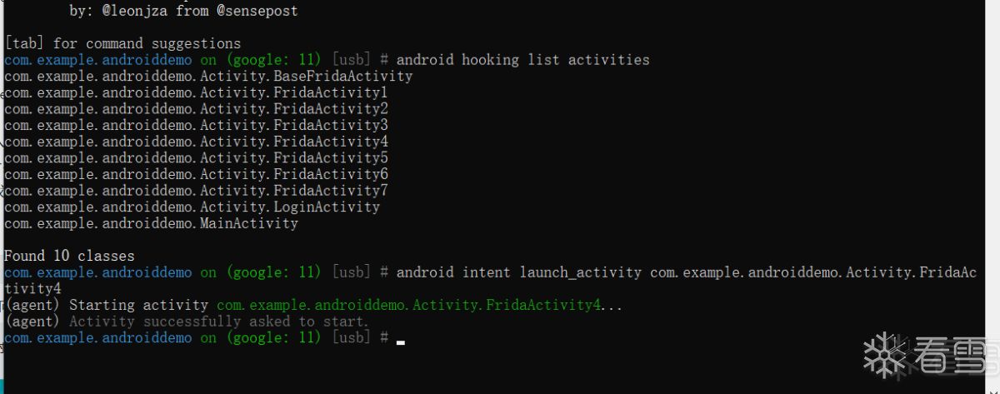

# android intent launch_activity

* 命令
  ```bash
  android intent launch_activity {AndroidIntentName}
  ```
  * 举例
    ```bash
    android intent launch_activity com.example.androiddemo.Activity.FridaActivity4
    ```
      * 
