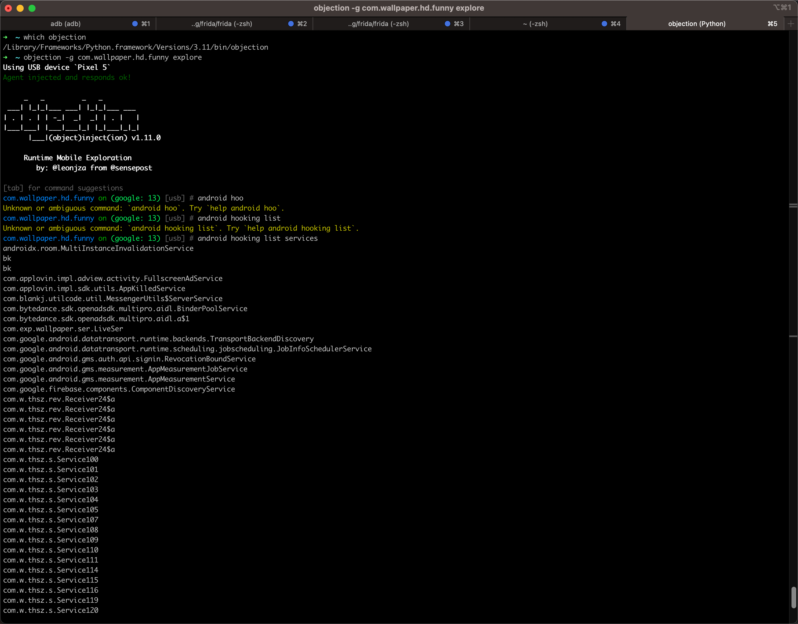
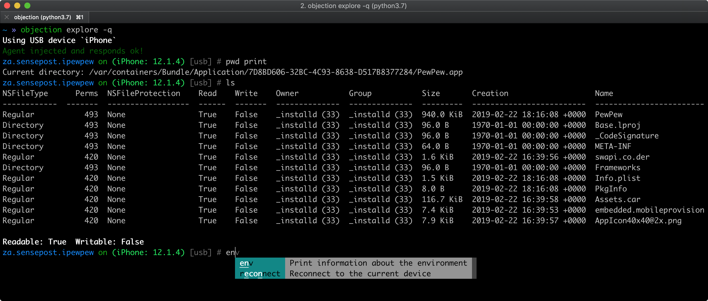

# Objection概览

* `Objection`
  * 是什么：底层依赖于[Frida](https://book.crifan.org/books/reverse_debug_frida/website/)的移动端（Android和iOS）的hook调试工具
  * 一句话概述：objection is a runtime mobile exploration toolkit, powered by Frida, built to help you assess the security posture of your mobile applications, without needing a jailbreak
  * 功能=特点
    * 支持iOS和Android
    * 支持查看和修改移动端的文件系统内容
    * 支持绕过SSL pinning=证书绑定（实现https抓包查看明文数据）
    * 支持导出keychains
    * 支持各种内存相关操作：dump导出、patching打补丁等
    * 支持操作Heap堆
    * 等等
  * Github
    * [sensepost/objection: 📱 objection - runtime mobile exploration (github.com)](https://github.com/sensepost/objection)
  * 截图
    * hook调试安卓
      * 
    * A file system listing of the iOS applications main bundle
      * 
    * A file system listing of the Android applications bundle
      * 
